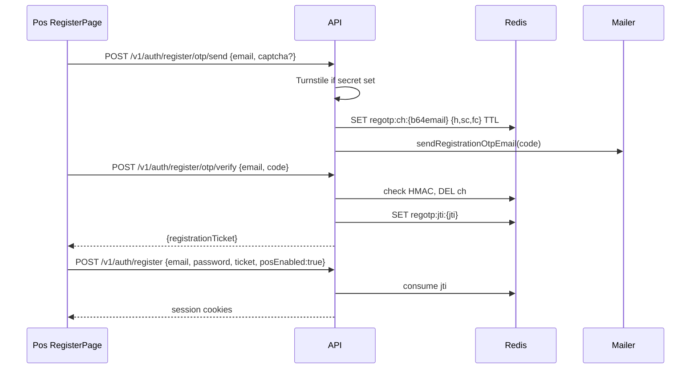
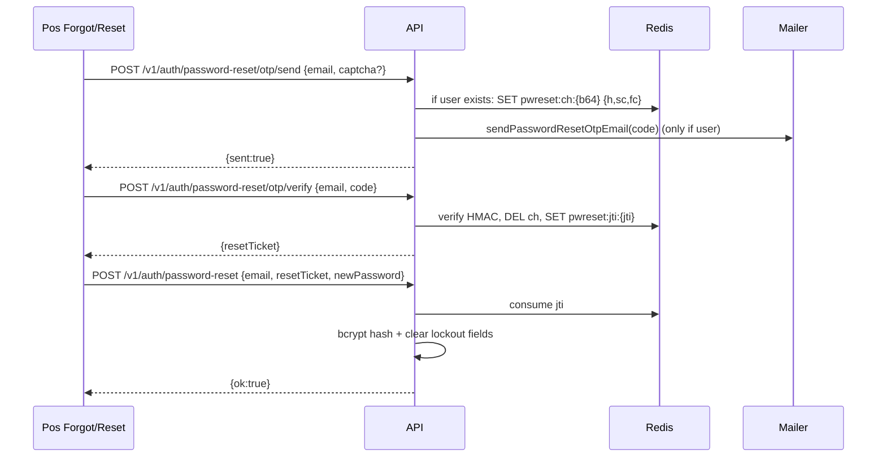

# Design: POS email OTP (register + password reset)

## Technical Approach

Reuse existing company-register OTP (`registration-otp.service` + `regotp:*` + ticket + `POST /v1/auth/register`). Switch Pos UI from magic-link to that path. Add parallel password-reset OTP (`pwreset:*`) as greenfield API + Pos screens. Keep link-register API for Hub/Hr. Align captcha: optional when `TURNSTILE_SECRET_KEY` unset.

## Architecture Decisions

| Decision | Options | Choice | Rationale |
|----------|---------|--------|-----------|
| Register on Pos | Keep link / dual / OTP-only | **OTP-only UI** | Product lock; API link stays for Hub/Hr |
| Reset storage | Prisma URL token / Redis OTP / both | **Redis OTP only** | Matches register OTP; Prisma `passwordResetToken*` unused (Hub link API still dead, out of scope) |
| Reset steps | 2-step (code+password) / 3-step + ticket | **3-step + resetTicket** | Mirrors register ticket; cleaner Pos screens |
| Captcha DTO | Always required / optional | **Optional `captchaToken`** | `verifyTurnstileToken` already skips when secret empty (non-prod); Zod must not block local |
| Pos captcha UX | Gate submit / send if present | **Mount Turnstile; do not block submit on null token** | interaction-only; no visible-captcha goal |
| Enumeration (reset send) | Reveal missing email / always `sent:true` | **Always `sent:true`** | Avoid account discovery |
| Rate-limit bucket | Share register OTP / dedicated | **Dedicated `ms-auth-password-reset-otp`** | Same limits (15 / 15m); isolate abuse |

## Data Flow

### Register (Pos)



### Password reset (Pos)



## Redis / security model

| Key | Value | TTL | Limits |
|-----|-------|-----|--------|
| `regotp:ch:{b64url(email)}` | `{h, sc, fc}` HMAC-SHA256(pepper, email\|code) | `OTP_CHALLENGE_TTL_SECONDS` | sc≤3 send; fc≥3 lockout delete |
| `regotp:jti:{jti}` | normalized email | ticket expiry | single-use at register |
| `pwreset:ch:{b64url(email)}` | same shape | same TTL | same 3·3 |
| `pwreset:jti:{jti}` | normalized email | ticket expiry (reuse `REGISTRATION_TICKET_EXPIRES_IN` or same TTL) | single-use at reset |

Pepper: `OTP_PEPPER` (≥8 prod) else `JWT_SECRET` (non-prod) — same as register OTP.

## Interfaces / Contracts

```http
POST /v1/auth/register/otp/send
{ "email": "...", "captchaToken"?: "..." }  → { sent: true }

POST /v1/auth/register/otp/verify
{ "email": "...", "code": "6 digits" } → { registrationTicket }

POST /v1/auth/register  (unchanged) + registrationTicket

POST /v1/auth/password-reset/otp/send
{ "email": "...", "captchaToken"?: "..." } → { sent: true }

POST /v1/auth/password-reset/otp/verify
{ "email": "...", "code": "6 digits" } → { resetTicket }

POST /v1/auth/password-reset
{ "email": "...", "resetTicket": "...", "newPassword": "min 8" } → { ok: true }
```

`resetTicket`: JWT purpose `password_reset` + Redis jti (clone `registration-ticket.service` pattern).

## File Changes

| File | Action | Description |
|------|--------|-------------|
| `apps/api/src/services/password-reset-otp.service.ts` | Create | send/verify OTP + pepper/HMAC/3·3 |
| `apps/api/src/services/password-reset-ticket.service.ts` | Create | issue/consume resetTicket |
| `apps/api/src/services/mailer.service.ts` | Modify | `sendPasswordResetOtpEmail` |
| `apps/api/src/dto/auth.dto.ts` | Modify | reset DTOs; `captchaToken` optional on register OTP send |
| `apps/api/src/controllers/v1/auth.controller.ts` | Modify | handlers + `registerPasswordResetOtpRoutes` |
| `apps/api/src/plugins/core/rate-limit.plugin.ts` | Modify | `ms-auth-password-reset-otp` bucket |
| `apps/api/src/__tests__/unit/password-reset-otp.service.test.ts` | Create | send limit / lockout / happy path |
| `apps/api/src/__tests__/unit/registration-otp.service.test.ts` | Modify | optional captcha when secret unset |
| `apps/pos/src/views/RegisterPage.tsx` | Modify | steps: form → otp → register; drop link API |
| `apps/pos/src/routes/(public)/register/verify.tsx` | Modify/Delete | expire/redirect (no Pos link UI) |
| `apps/pos/src/views/ForgotPasswordPage.tsx` (+ route) | Create | email → OTP send |
| `apps/pos/src/views/ResetPasswordPage.tsx` (+ route) | Create | code → ticket → new password |
| `apps/pos/src/views/LoginPage.tsx` | Modify | ¿Olvidaste? → `/forgot-password` (local) |
| `apps/pos/src/views/__tests__/RegisterPage.shell.test.tsx` | Modify | assert otp/send|verify|register |
| Hub/Hr register + link API | Unchanged | out of scope |

## Testing Strategy

| Layer | What | Approach |
|-------|------|----------|
| Unit | reset OTP 3·3, ticket consume, captcha skip | Vitest + Redis mock (clone registration-otp tests) |
| Unit | register OTP captcha optional | extend existing tests |
| Pos shell | Register OTP path; forgot link target | Vitest view tests |
| Integration | optional if CI Redis available | smoke send→verify→reset |

## Threat Matrix

N/A — no shell/subprocess/VCS/executable-classification boundary; HTTP auth OTP only.

## Migration / Rollout

1. Deploy API (reset routes + optional captcha) before Pos UI.
2. Cut Pos register to OTP; leave Hub/Hr on link.
3. In-flight Pos magic links expire via Redis TTL — no DB migration.
4. Rollback: revert Pos to link UI; disable/ignore reset routes; Redis TTLs self-clear.

## Open Questions

- [ ] Reset ticket JWT secret: reuse registration-ticket secret vs dedicated env — **default: reuse** unless security review prefers split.
- [ ] After successful reset: revoke other sessions? — **default: no** (out of scope; optional follow-up).
- [ ] Clear Prisma `passwordResetToken*` on OTP reset? — **default: noop** (fields unused).
