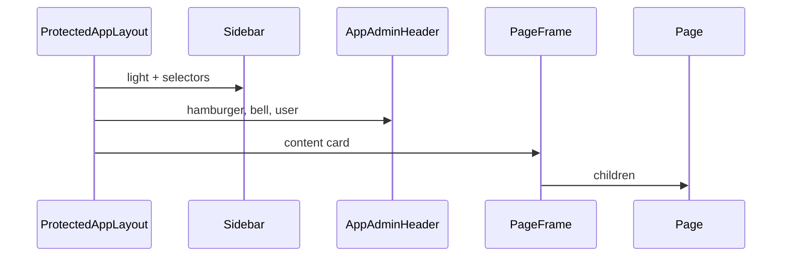

# Design: Pos webapp shell remodel

## Technical Approach

Remodel Pos `/app/*` to a light Spike-Admin **pattern** shell (sidebar + header + content card) and shared list chrome via Hubilee tokens, **Pos-first** composition, `@hubilee/ui` primitives, **no API changes**. Capabilities: `pos-webapp-admin-shell`, `pos-admin-list-pattern`.

Today: dark `Sidebar`, no header, `PageFrame` without card; lists have search/CTA/table but dated styling.

## Architecture Decisions

| Decision | Options | Tradeoff | Choice |
|----------|---------|----------|--------|
| Shell ownership | Shared pkg vs Pos-only | Hub/HR risk | **Pos-only** (`ProtectedAppLayout` + wrappers) |
| `@hubilee/ui` | Breaking vs additive | Blast radius | **Additive only**; Pos first |
| Theme | Toggle / dark / light | Locked v1 | **Light only**; no dark-mode work |
| Header search | Spike search vs omit | No Pos feature | **Omit**; keep list-local search |
| Header utils | Full Spike vs real features | Fake chrome | **Hamburger + bell + user** (move bell from sidebar) |
| Soft pills | Pos helper vs Badge | Package churn | **Pos SoftStatusPill**; optional Badge later |
| Mobile | Icon rail vs hamburger | Shared = icon rail | **Pos overlay drawer** from header; keep Sidebar API stable |
| Lists | Copy-paste vs helpers | Drift | **Shared Pos helpers**, then apply |

## Layout (`pos-webapp-admin-shell`)

```
Sidebar(light) | AppAdminHeader(hamburger | · | bell | user)
               | PageFrame card (title + children) on muted canvas
```

- Keep Pos `navGroups`; `variant="light"`; light company/store selects; Hubilee brand (not Spike).
- Header: no fake search/theme/lang/cart.
- Scope: `(app)` `/app/*` only; landing/auth/PWA unchanged.



## List Pattern (`pos-admin-list-pattern`)

Helpers: **AdminListToolbar** (search + Add when already present), **IdentityCell**, **SoftStatusPill**, icon actions (keep dialogs/permissions). Apply to customers, products, suppliers, users, categories, inventory/low-stock, backup. Preserve hooks/filters/sort/pagination. Non-list pages: PageFrame wrap only.

## Tokens

Use Pos `:root` HSL (`--background`, `--card`, `--muted`, `--primary`, `--radius`). Soften canvas/card radius/shadow toward Spike without cloning Spike brand blues. Replace dark-hardcoded selector classes in Pos Sidebar. Do not ship `.dark` for this shell.

## File Changes

| File | Action | Description |
|------|--------|-------------|
| `ProtectedAppLayout.tsx` | Modify | Sidebar + header column + landmarks |
| `layout/AppAdminHeader.tsx` | Create | Hamburger, bell, user |
| `layout/Sidebar.tsx` | Modify | Light variant/selectors; drop append bell |
| `views/PageFrame.tsx` | Modify | Muted canvas + rounded card |
| `admin/AdminListToolbar.tsx` | Create | Search + CTA row |
| `admin/SoftStatusPill.tsx` | Create | Pastel status/role pill |
| `admin/IdentityCell.tsx` | Create | Avatar + title + subtitle |
| Scoped lists (7) | Modify | Adopt helpers; keep data hooks |
| `globals.css` | Modify | Optional admin utilities |
| `packages/ui` sidebar/badge | Optional | Additive only if needed |
| Vitest shell + list smokes | Create | Landmark assertions (TDD) |

## Contracts

```ts
type AdminListToolbarProps = {
  search?: { value: string; onChange: (v: string) => void; placeholder: string }
  primaryAction?: { label: string; href?: string; onClick?: () => void }
  filters?: React.ReactNode
}
```

No new REST. Nav modules unchanged.

## Testing

| Layer | What | Approach |
|-------|------|----------|
| Unit | Shell landmarks; list toolbar/table/pills | Vitest + RTL RED→GREEN |
| Unit | Parameterized list smokes | Shared helper × scoped lists |

## Threat Matrix

N/A — same `/app/*` auth; no shell/subprocess/VCS/executable boundaries.

## Migration / Sequencing

No DB migration. Tasks: (1) shell + smoke, (2) list helpers + pilot list, (3) remaining lists, (4) optional additive UI. Rollback = revert Pos (+ optional UI).

## Open Questions

- [x] Header global search — omit
- [ ] Soft-pill hue map (apply visual pass)
- [ ] CTA only if already present (categories/inventory/backup)
- [ ] Shared Sidebar collapsible API vs Pos-local overlay
